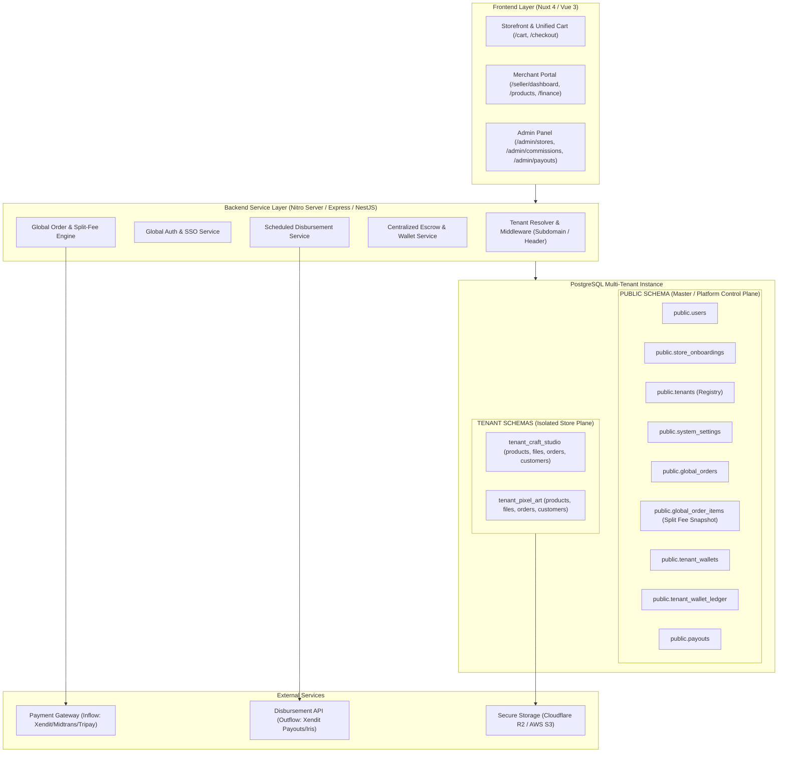
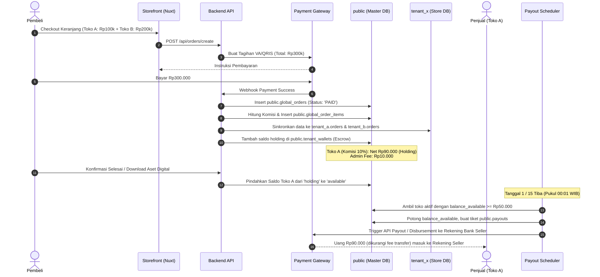
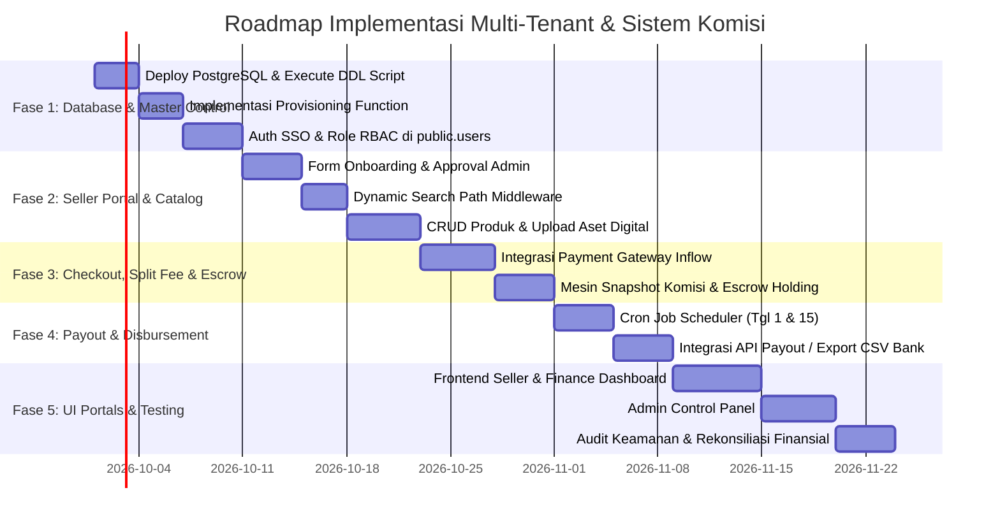

# MASTER BLUEPRINT: ARSITEKTUR LENGKAP MULTI-VENDOR MARKETPLACE (SCHEMA-PER-TENANT), SISTEM KOMISI DINAMIS, ESCROW, DAN PAYOUT TERJADWAL

> **Dokumen Spesifikasi & Rancang Bangun Sistem**  
> Proyek: **iCraft Marketplace (`ic-market`)**  
> Pola Database: **PostgreSQL Multi-Tenancy by Schema (Schema-per-Tenant)**  
> Script DDL SQL: [`schema_multitenant_pgsql.sql`](./schema_multitenant_pgsql.sql)  
> Dokumentasi Database: [`MULTITENANT_DATABASE_ARCHITECTURE.md`](./MULTITENANT_DATABASE_ARCHITECTURE.md)

---

## DAFTAR ISI
1. [Ringkasan Eksekutif & Visi Sistem](#1-ringkasan-eksekutif--visi-sistem)
2. [Audit Kondisi Saat Ini (Current State - `ic-market-fe`)](#2-audit-kondisi-saat-ini-current-state---ic-market-fe)
3. [Arsitektur Target & Pola Multi-Tenant by Schema](#3-arsitektur-target--pola-multi-tenant-by-schema)
4. [Role-Based Access Control (RBAC) & User Journeys](#4-role-based-access-control-rbac--user-journeys)
5. [Skema Database Lengkap: Public Master & Tenant Template](#5-skema-database-lengkap-public-master--tenant-template)
6. [Mekanisme Finansial: Komisi Dinamis, Escrow, dan Payout](#6-mekanisme-finansial-komisi-dinamis-escrow-dan-payout)
7. [Spesifikasi REST API, Tenant Context & Webhooks](#7-spesifikasi-rest-api-tenant-context--webhooks)
8. [Struktur Halaman Frontend & Kebutuhan UI (Nuxt 4)](#8-struktur-halaman-frontend--kebutuhan-ui-nuxt-4)
9. [Penanganan Kasus Khusus, Keamanan & Edge Cases](#9-penanganan-kasus-khusus-keamanan--edge-cases)
10. [Roadmap Implementasi Bertahap (Step-by-Step Plan)](#10-roadmap-implementasi-bertahap-step-by-step-plan)

---

## 1. Ringkasan Eksekutif & Visi Sistem

Marketplace **iCraft** dirancang untuk bertransformasi dari sebuah katalog belanja statis (*single-store demo*) menjadi platform **Multi-Vendor Marketplace** kelas enterprise dengan isolasi data tingkat tinggi menggunakan **Pola Multi-Tenancy by Schema** di PostgreSQL.

### Nilai Utama Sistem yang Dibangun:
1. **Isolasi Schema per Toko (*Tenant-per-Schema Isolation*)**: Setiap toko memiliki schema database terisolasi (`tenant_<store_slug>`) untuk katalog produk, file digital, dan pelanggannya.
2. **Pusat Kontrol Finansial Terpusat (`public` schema)**: Seluruh data pembayaran masuk (*inflow*), pemotongan komisi platform, dompet penampung escrow, dan pencairan (*payout/disbursement*) tersentralisasi di `public` schema.
3. **Pendaftaran & KYC Toko Otomatis (*Automated Provisioning*)**: Saat pengajuan toko disetujui, sistem secara otomatis mengeksekusi pembuatan schema database baru dan mengkloning seluruh tabel toko.
4. **Mesin Komisi Dinamis (*Dynamic Revenue Sharing*)**: Potongan komisi memiliki nilai *default* global (misal 10%), tetapi dapat di-override secara dinamis per toko (misal toko partner hanya 5%) maupun per produk.
5. **Pencairan Dana Terjadwal (*Scheduled Payout / Disbursement*)**: Hak bersih toko ditahan dalam status escrow hingga pesanan selesai, kemudian otomatis ditransfer ke rekening bank penjual pada tanggal tertentu (misal: tgl 1 dan 15 tiap bulan) via Cron Job / Payout API.

---

## 2. Audit Kondisi Saat Ini (Current State - `ic-market-fe`)

Aplikasi yang ada saat ini di repositori adalah frontend prototype berbasis **Nuxt 4 + Vue 3 (Vanilla CSS)**:

```
ic-market-fe/
├── app/
│   ├── components/       # FlowHeader, OrderSummary, ProgressSteps, SecurityBadges
│   ├── layouts/          # default.vue, flow.vue
│   └── pages/
│       ├── index.vue     # Katalog produk statis, filter kategori, search bar, wishlist
│       ├── cart.vue      # Keranjang belanja berbasis localStorage & kode promo
│       ├── checkout.vue  # Formulir alamat/data pembeli & pilihan bank/gateway (Mock)
│       ├── payment.vue   # Countdown timer, petunjuk transfer, simulasi upload bukti bayar
│       └── success.vue   # Invoice sukses (Mock)
```

### Tabel Perbandingan Kondisi:

| Komponen | Kondisi Saat Ini (`ic-market-fe`) | Target Sistem Multi-Tenant Schema |
| :--- | :--- | :--- |
| **Penyimpanan Data** | `localStorage` browser statis | Database PostgreSQL Multi-Tenant by Schema |
| **Model Toko** | Belum ada entitas toko/merchant | Schema Terisolasi (`public.tenants` $\to$ `tenant_*`) |
| **Autentikasi & Akun** | Tidak ada login / register | SSO Terpusat di `public.users` (Admin, Seller, Buyer) |
| **Alur Pembayaran** | Mock static transfer & alert | Terintegrasi Payment Gateway (Xendit / Midtrans / Tripay) |
| **Pengelolaan Dana** | Simulasi tanpa mutasi uang | `public.tenant_wallets` (Escrow Holding $\to$ Available) |
| **Sistem Komisi** | Tidak ada perhitungan komisi | Dynamic Commission Resolution (Hierarki Komisi) |
| **Pencairan (Payout)** | Tidak ada modul pencairan | `public.payouts` terjadwal (Tgl 1 & 15 via Cron Job) |

---

## 3. Arsitektur Target & Pola Multi-Tenant by Schema



---

## 4. Role-Based Access Control (RBAC) & User Journeys

### A. Hak Akses (Roles)
1. **`buyer` (Pembeli)**: Akun terdaftar di `public.users`. Dapat berbelanja produk dari toko manapun, 1x bayar total, dan mengunduh produk digital atau memantau pengiriman.
2. **`seller` (Penjual / Pemilik Toko)**: Akun terdaftar di `public.users`, memiliki entitas di `public.tenants`, dan mengelola data produk/order pada schema tokonya (`tenant_<slug>`).
3. **`admin` (Super Admin)**: Mengatur komisi platform global, me-review pengajuan toko (KYC), mengelola toko, dan mengesahkan batch payout.
4. **`finance` (Finance Officer)**: Memvalidasi rekap pencairan dana, rekonsiliasi pembayaran payment gateway, dan mengeksekusi transfer bank.

---

### B. User Journey Transaksi & Finansial Multi-Tenant



---

## 5. Skema Database Lengkap: Public Master & Tenant Template

Struktur DDL SQL lengkap tersedia di file [`schema_multitenant_pgsql.sql`](./schema_multitenant_pgsql.sql).

### A. Tabel Utama di `public` Schema (Control Plane)

```sql
-- 1. Master Pengguna
CREATE TABLE public.users (
    id UUID PRIMARY KEY DEFAULT gen_random_uuid(),
    email VARCHAR(150) UNIQUE NOT NULL,
    password_hash VARCHAR(255) NOT NULL,
    full_name VARCHAR(120) NOT NULL,
    phone_number VARCHAR(25),
    role VARCHAR(20) NOT NULL DEFAULT 'buyer', -- 'admin', 'finance', 'seller', 'buyer'
    is_active BOOLEAN DEFAULT TRUE,
    created_at TIMESTAMP WITH TIME ZONE DEFAULT NOW()
);

-- 2. Formulir KYC Onboarding Toko
CREATE TABLE public.store_onboardings (
    id UUID PRIMARY KEY DEFAULT gen_random_uuid(),
    user_id UUID NOT NULL REFERENCES public.users(id) ON DELETE CASCADE,
    requested_store_name VARCHAR(150) NOT NULL,
    requested_slug VARCHAR(150) UNIQUE NOT NULL,
    identity_card_number VARCHAR(50),
    identity_card_file_url VARCHAR(255),
    bank_name VARCHAR(50) NOT NULL,
    bank_account_number VARCHAR(50) NOT NULL,
    bank_account_holder VARCHAR(120) NOT NULL,
    verification_status VARCHAR(30) DEFAULT 'submitted', -- 'submitted', 'in_review', 'approved', 'rejected'
    created_at TIMESTAMP WITH TIME ZONE DEFAULT NOW()
);

-- 3. Master Toko & Routing Schema (Tenant Registry)
CREATE TABLE public.tenants (
    id UUID PRIMARY KEY DEFAULT gen_random_uuid(),
    owner_user_id UUID NOT NULL REFERENCES public.users(id) ON DELETE RESTRICT,
    name VARCHAR(150) NOT NULL,
    slug VARCHAR(150) UNIQUE NOT NULL,
    schema_name VARCHAR(63) UNIQUE NOT NULL, -- Contoh: 'tenant_craft_studio'
    custom_domain VARCHAR(255) UNIQUE NULL,
    status VARCHAR(30) DEFAULT 'active',
    
    -- Override Komisi Khusus Toko (Jika NULL, pakai default sistem)
    custom_commission_rate DECIMAL(5,2) NULL,
    
    bank_name VARCHAR(50) NOT NULL,
    bank_account_number VARCHAR(50) NOT NULL,
    bank_account_holder VARCHAR(120) NOT NULL,
    created_at TIMESTAMP WITH TIME ZONE DEFAULT NOW()
);

-- 4. Pengaturan Sistem Global
CREATE TABLE public.system_settings (
    key VARCHAR(50) PRIMARY KEY,
    value JSONB NOT NULL,
    description TEXT,
    updated_at TIMESTAMP WITH TIME ZONE DEFAULT NOW()
);

-- 5. Transaksi Masuk Global (Inflow)
CREATE TABLE public.global_orders (
    id UUID PRIMARY KEY DEFAULT gen_random_uuid(),
    order_number VARCHAR(50) UNIQUE NOT NULL,
    buyer_user_id UUID REFERENCES public.users(id),
    buyer_name VARCHAR(120) NOT NULL,
    buyer_email VARCHAR(150) NOT NULL,
    total_gross_amount DECIMAL(15,2) NOT NULL,
    net_payable_amount DECIMAL(15,2) NOT NULL,
    payment_gateway VARCHAR(50) DEFAULT 'xendit',
    payment_status VARCHAR(30) DEFAULT 'pending',
    payment_gateway_ref VARCHAR(100),
    paid_at TIMESTAMP WITH TIME ZONE,
    created_at TIMESTAMP WITH TIME ZONE DEFAULT NOW()
);

-- 6. Snapshot Split-Fee Komisi per Item (Immutable)
CREATE TABLE public.global_order_items (
    id UUID PRIMARY KEY DEFAULT gen_random_uuid(),
    global_order_id UUID NOT NULL REFERENCES public.global_orders(id) ON DELETE CASCADE,
    tenant_id UUID NOT NULL REFERENCES public.tenants(id) ON DELETE RESTRICT,
    product_id UUID NOT NULL,
    product_title VARCHAR(255) NOT NULL,
    unit_price DECIMAL(15,2) NOT NULL,
    quantity INT NOT NULL DEFAULT 1,
    subtotal DECIMAL(15,2) NOT NULL,
    
    applied_commission_rate DECIMAL(5,2) NOT NULL, -- Snapshot % komisi
    platform_fee_amount DECIMAL(15,2) NOT NULL,    -- Subtotal * % Komisi (Hak Admin)
    seller_net_amount DECIMAL(15,2) NOT NULL,      -- Subtotal - Fee (Hak Toko)
    
    escrow_status VARCHAR(30) DEFAULT 'held',     -- 'held', 'released_to_wallet', 'refunded'
    escrow_released_at TIMESTAMP WITH TIME ZONE,
    created_at TIMESTAMP WITH TIME ZONE DEFAULT NOW()
);

-- 7. Dompet Toko & Buku Besar Terpusat
CREATE TABLE public.tenant_wallets (
    tenant_id UUID PRIMARY KEY REFERENCES public.tenants(id) ON DELETE CASCADE,
    balance_holding DECIMAL(15,2) DEFAULT 0,   -- Saldo tertahan di escrow
    balance_available DECIMAL(15,2) DEFAULT 0, -- Saldo siap ditarik
    balance_withdrawn DECIMAL(15,2) DEFAULT 0, -- Total sudah ditarik
    updated_at TIMESTAMP WITH TIME ZONE DEFAULT NOW()
);

CREATE TABLE public.tenant_wallet_ledger (
    id UUID PRIMARY KEY DEFAULT gen_random_uuid(),
    tenant_id UUID NOT NULL REFERENCES public.tenants(id) ON DELETE CASCADE,
    order_item_id UUID REFERENCES public.global_order_items(id),
    payout_id UUID NULL,
    transaction_type VARCHAR(30) NOT NULL, -- 'ORDER_ESCROW_HOLD', 'ESCROW_RELEASE', 'PAYOUT_DEDUCT', 'REFUND_DEBIT'
    amount DECIMAL(15,2) NOT NULL,
    balance_bucket VARCHAR(20) NOT NULL,   -- 'holding' atau 'available'
    flow_direction VARCHAR(10) NOT NULL,   -- 'IN' atau 'OUT'
    running_balance DECIMAL(15,2) NOT NULL,
    notes TEXT NOT NULL,
    created_at TIMESTAMP WITH TIME ZONE DEFAULT NOW()
);

-- 8. Payout & Pencairan Dana Terjadwal (Outflow)
CREATE TABLE public.payouts (
    id UUID PRIMARY KEY DEFAULT gen_random_uuid(),
    payout_number VARCHAR(50) UNIQUE NOT NULL,
    tenant_id UUID NOT NULL REFERENCES public.tenants(id) ON DELETE RESTRICT,
    gross_payout_amount DECIMAL(15,2) NOT NULL,
    bank_transfer_fee DECIMAL(15,2) DEFAULT 0,
    net_disbursed_amount DECIMAL(15,2) NOT NULL,
    bank_name VARCHAR(50) NOT NULL,
    bank_account_number VARCHAR(50) NOT NULL,
    bank_account_holder VARCHAR(120) NOT NULL,
    status VARCHAR(30) DEFAULT 'scheduled', -- 'scheduled', 'processing', 'completed', 'failed'
    scheduled_date DATE NOT NULL,
    processed_at TIMESTAMP WITH TIME ZONE,
    disbursement_gateway_ref VARCHAR(100),
    created_at TIMESTAMP WITH TIME ZONE DEFAULT NOW()
);
```

---

### B. Template Schema per Toko (`tenant_template.*`)

Setiap schema toko (`tenant_<slug>`) memiliki tabel-tabel berikut:
* `store_settings`: Jam operasional, banner, profil internal.
* `categories`: Kategori internal toko.
* `products`: Master produk toko, SKU, harga, stok, flag digital, dan komisi override.
* `product_details`: Deskripsi panjang, tags, spesifikasi teknis, SEO.
* `product_images`: Galeri foto & preview.
* `product_digital_files`: Penyimpanan aman key storage file digital di S3/Cloudflare R2.
* `customers`: Direktori pelanggan toko & metrik belanja (*LTV*).
* `orders` & `order_items`: Pesanan lokal toko dan kuota download file digital.
* `coupons`: Voucher diskon toko.
* `product_reviews`: Ulasan & rating produk.

---

### C. Fungsi Otomatisasi Provisioning Schema (`public.provision_new_tenant`)

Saat Admin menyetujui onboarding toko, backend cukup menjalankan:

```sql
SELECT public.provision_new_tenant(
    p_owner_user_id     := 'a0eebc99-9c0b-4ef8-bb6d-6bb9bd380a11',
    p_store_name        := 'Craft Studio',
    p_slug              := 'craft-studio',
    p_bank_name         := 'BCA',
    p_bank_acc_no       := '8830123456',
    p_bank_acc_holder   := 'Rifki Ahmad',
    p_custom_commission := 7.50 -- Opsional
);
```

Fungsi ini otomatis:
1. Menambahkan data toko di `public.tenants`.
2. Membuat schema baru: `CREATE SCHEMA tenant_craft_studio;`.
3. Mengkloning seluruh tabel dari `tenant_template` ke `tenant_craft_studio`.
4. Menginisialisasi dompet toko di `public.tenant_wallets`.

---

## 6. Mekanisme Finansial: Komisi Dinamis, Escrow, dan Payout

### A. Rumus Hierarki Komisi Dinamis
$$\text{Komisi Berlaku (\%)} = \begin{cases} 
\text{product.commission\_override\_rate} & \text{jika diset khusus di produk} \\
\text{tenant.custom\_commission\_rate} & \text{jika diset khusus di toko} \\
\text{system\_settings.default\_commission\_rate} & \text{fallback default platform (misal 10\%)}
\end{cases}$$

---

### B. Siklus Escrow Saldo Dompet Toko

```
[1. Pembeli Bayar Rp 200.000]
     │ (Komisi Toko: 10% = Rp 20.000, Hak Toko: Rp 180.000)
     ▼
Rp 180.000 masuk ke: `public.tenant_wallets.balance_holding`
     │
     ▼ (Pesanan Selesai / Instant untuk File Digital / H+3 Garansi Fisik)
Rp 180.000 dipindahkan: `balance_holding` ──► `balance_available`
     │
     ▼ (Tanggal Payout: Tgl 1 & 15 via Cron Job)
Jika `balance_available >= Rp 50.000`:
     ├─► Lock saldo available & catat ke `public.payouts`
     └─► Transfer ke Rekening Bank Seller via Xendit Payout / Iris Midtrans
```

---

### C. Logika Cron Job / Payout Scheduler

Scheduler berjalan otomatis pada tanggal yang ditentukan (misal tanggal 1 dan 15 pukul 00:01 WIB):

```javascript
// Pseudocode Scheduler Payout Otomatis
async function processScheduledPayouts() {
    const today = new Date();
    const currentDay = today.getDate(); // 1 atau 15
    
    // 1. Baca konfigurasi payout dari public.system_settings
    const config = await db.query(
        "SELECT value FROM public.system_settings WHERE key = 'payout_schedule'"
    );
    const { dates, min_payout_amount, transfer_fee } = config.rows[0].value;
    
    if (!dates.includes(currentDay)) {
        return; // Bukan tanggal pencairan
    }
    
    // 2. Cari semua toko yang memiliki saldo siap cair >= minimum
    const eligibleTenants = await db.query(`
        SELECT t.id, t.name, t.bank_name, t.bank_account_number, t.bank_account_holder, w.balance_available
        FROM public.tenants t
        JOIN public.tenant_wallets w ON t.id = w.tenant_id
        WHERE w.balance_available >= $1 AND t.status = 'active'
    `, [min_payout_amount]);

    for (const tenant of eligibleTenants.rows) {
        const grossAmount = parseFloat(tenant.balance_available);
        const netDisbursed = grossAmount - transfer_fee;

        await db.transaction(async (trx) => {
            // A. Potong saldo available toko & tambahkan ke balance_withdrawn
            await trx.query(`
                UPDATE public.tenant_wallets 
                SET balance_available = balance_available - $1,
                    balance_withdrawn = balance_withdrawn + $1,
                    updated_at = NOW()
                WHERE tenant_id = $2
            `, [grossAmount, tenant.id]);

            // B. Buat tiket Payout di public.payouts
            const payoutResult = await trx.query(`
                INSERT INTO public.payouts (
                    payout_number, tenant_id, gross_payout_amount, bank_transfer_fee,
                    net_disbursed_amount, bank_name, bank_account_number,
                    bank_account_holder, status, scheduled_date
                ) VALUES (
                    $1, $2, $3, $4, $5, $6, $7, $8, 'scheduled', $9
                ) RETURNING id, payout_number
            `, [
                `PO-${Date.now()}-${tenant.id.slice(0,4)}`,
                tenant.id, grossAmount, transfer_fee, netDisbursed,
                tenant.bank_name, tenant.bank_account_number, tenant.bank_account_holder,
                today
            ]);

            // C. Catat di public.tenant_wallet_ledger
            await trx.query(`
                INSERT INTO public.tenant_wallet_ledger (
                    tenant_id, payout_id, transaction_type, amount,
                    balance_bucket, flow_direction, running_balance, notes
                ) VALUES ($1, $2, 'PAYOUT_DEDUCT', $3, 'available', 'OUT', 0, $4)
            `, [
                tenant.id, payoutResult.rows[0].id, grossAmount,
                `Pencairan terjadwal ${payoutResult.rows[0].payout_number}`
            ]);

            // D. Eksekusi API Disbursement Gateway (Xendit Payout / Iris Midtrans)
            // await disbursementGateway.send({
            //     accountNumber: tenant.bank_account_number,
            //     bankCode: tenant.bank_name,
            //     amount: netDisbursed
            // });
        });
    }
}
```

---

## 7. Spesifikasi REST API, Tenant Context & Webhooks

### A. Mekanisme Akses Data Tenant di Backend
Backend mengidentifikasi toko penjual berdasarkan token autentikasi (JWT) atau slug domain, kemudian mengatur `search_path` PostgreSQL:

```typescript
// Middleware Pengaturan Search Path Dinamis
async function setTenantContext(client: PoolClient, schemaName: string) {
    await client.query(`SET search_path TO "${schemaName}", public;`);
}
```

### B. Daftar Endpoint API Utama

#### 1. Autentikasi & Onboarding (`public` level)
* `POST /api/auth/register` : Daftar akun baru (Role: `buyer`).
* `POST /api/auth/login` : Login user & penerbitan token JWT.
* `POST /api/seller/onboard` : Pengajuan buka toko (KTP/NPWP, nama toko, rekening bank).

#### 2. Portal Penjual (`tenant` level via `SET search_path`)
* `GET /api/seller/dashboard` : Ringkasan performa penjualan toko.
* `GET /api/seller/products` : Mengambil produk dari `tenant_<slug>.products`.
* `POST /api/seller/products` : Menambah produk & upload aset digital ke storage.
* `GET /api/seller/finance` : Membaca `public.tenant_wallets` & `public.payouts` milik toko tsb.

#### 3. Storefront & Transaksi Masuk
* `GET /api/catalog/products` : Pencarian produk lintas toko.
* `POST /api/checkout/create-order` : Membuat `public.global_orders` & Snap Token Payment Gateway.
* `POST /api/webhooks/payment-gateway` : Callback notifikasi bayar $\to$ Alokasi komisi & Escrow.

#### 4. Admin Control Panel
* `GET /api/admin/onboardings` : Daftar pengajuan toko pending review.
* `POST /api/admin/onboardings/:id/approve` : Menjalankan `public.provision_new_tenant()`.
* `PUT /api/admin/tenants/:id/commission` : Mengatur custom % komisi toko.
* `GET /api/admin/payouts` : Daftar antrean payout & tombol eksekusi batch.

---

## 8. Struktur Halaman Frontend & Kebutuhan UI (Nuxt 4)

```
app/
├── pages/
│   ├── index.vue                  # [UPDATE] Label toko penjual di setiap card produk
│   ├── cart.vue                   # [UPDATE] Pengelompokan item per toko di keranjang
│   ├── checkout.vue               # [UPDATE] Terintegrasi API Snap Payment Gateway
│   ├── payment.vue                # [UPDATE] Menampilkan VA / QRIS dinamis asli
│   ├── success.vue                # [UPDATE] Tombol akses download file digital
│   │
│   ├── store/
│   │   └── [slug].vue             # [NEW] Halaman profil & katalog khusus satu toko
│   │
│   ├── seller/
│   │   ├── register.vue           # [NEW] Form pengajuan buka toko & rekening bank
│   │   ├── dashboard.vue          # [NEW] Metrik penjualan toko & order baru
│   │   ├── products/
│   │   │   ├── index.vue          # [NEW] CRUD produk toko
│   │   │   └── create.vue         # [NEW] Upload gambar & file digital
│   │   └── finance.vue            # [NEW] Dompet Toko: Saldo Holding, Saldo Available, & Jadwal Payout
│   │
│   └── admin/
│       ├── onboardings.vue        # [NEW] Verifikasi pengajuan toko baru (Approve/Reject)
│       ├── stores.vue             # [NEW] Kelola toko & setting custom % komisi
│       ├── settings.vue           # [NEW] Setting default komisi platform & aturan payout
│       └── payouts.vue            # [NEW] Manajemen Payout & Eksekusi Batch Transfer
```

---

## 9. Penanganan Kasus Khusus, Keamanan & Edge Cases

1. **Idempotency Webhook**: Setiap notifikasi webhook dari Payment Gateway diverifikasi dengan `order_id` & `status` agar saldo escrow tidak terkredit ganda.
2. **Audit Double-Entry**: Saldo di `public.tenant_wallets` harus selalu sama dengan rekonsiliasi penjumlahan di `public.tenant_wallet_ledger`.
3. **Refund & Pembatalan**: Jika pesanan dibatalkan sebelum escrow dilepas, saldo di `balance_holding` langsung didebit kembali tanpa mengganggu saldo toko lain.
4. **Keamanan File Digital**: File aset digital berbayar disimpan di bucket private S3/R2 dan hanya diberikan berupa *Presigned Download URL* dengan masa kedaluwarsa singkat setelah status order terverifikasi `PAID`.

---

## 10. Roadmap Implementasi Bertahap (Step-by-Step Plan)



---

## Kesimpulan

Dokumen arsitektur ini beserta script SQL di [`schema_multitenant_pgsql.sql`](./schema_multitenant_pgsql.sql) memberikan fondasi yang:
* **Terisolasi & Aman**: Data produk, detail teknis, dan pelanggan setiap toko tersimpan pada schema PostgreSQL yang terpisah.
* **Tersentralisasi secara Finansial**: Aliran dana, potongan komisi sistem, penahanan escrow, dan pencairan rekening bank terkontrol penuh di `public` schema.
* **Otomatis & Fleksibel**: Provisioning schema toko baru dan transfer pencairan terjadwal berjalan secara terprogram.
